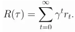
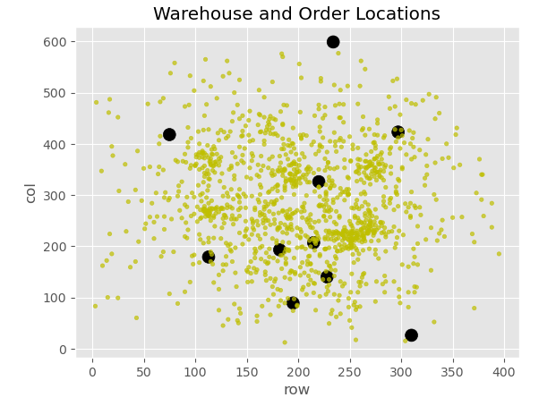
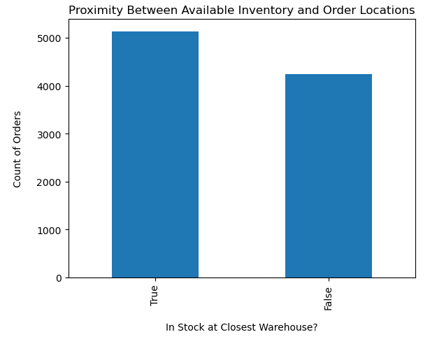
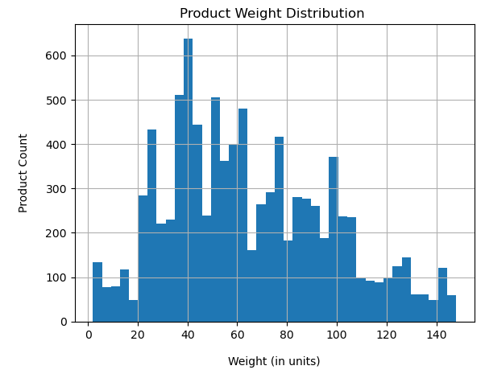
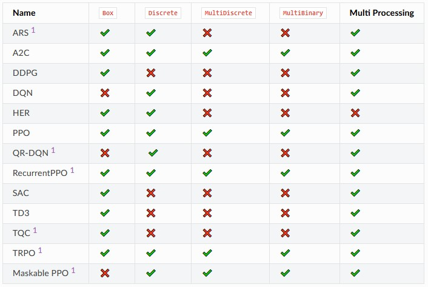
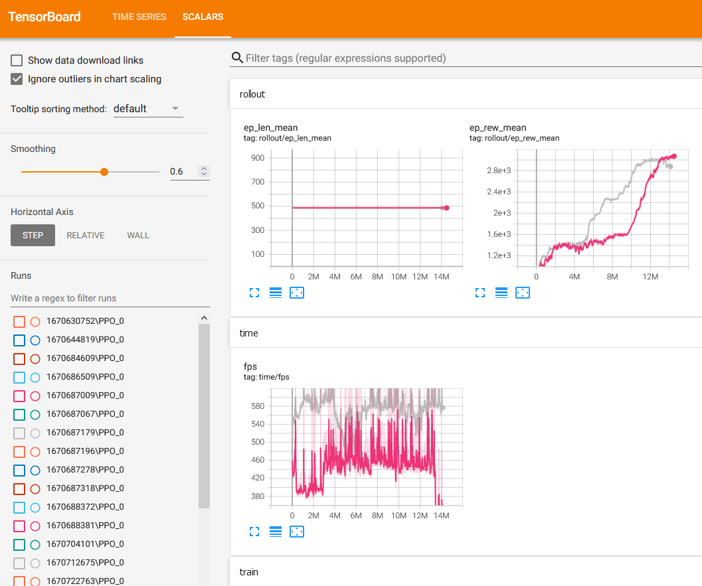
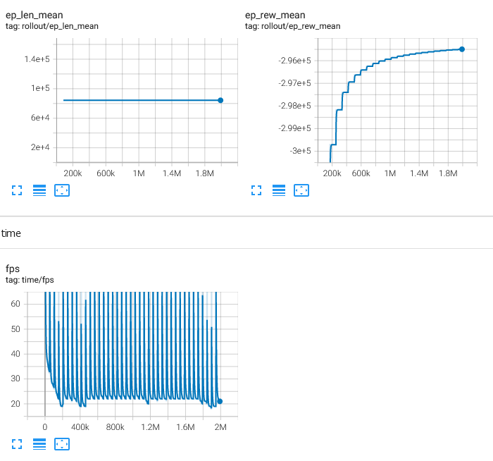
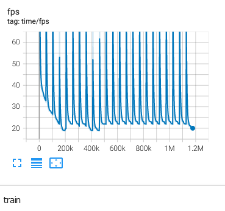

# Drone Delivery 

* This repository holds an attempt to apply model-free Reinforcement Learning techniques to optimize product delivery times as detailed in the ["Drone Delivery" Kaggle challenge](https://www.kaggle.com/competitions/hashcode-drone-delivery/overview). This project is superceded by [my current modification of this effort(Dec 2022)](https://github.com/GregWells/DroneDelivery_v2)

## Overview

  * **Drone Delivery challenge:**  The task, as defined by the Kaggle challenge, is to develop code that will read a variable input file of system setup parameters and customer orders, and subsequently generate a submission file detailing each action that will be performed. The submission file will subsequently be scored by Kaggle based on how rapidly each order was delivered.   

* The methodology employed for this attempt was to train a model via reinforcement learning (RL) techniques the allowable options such as where products are located, how much weight a drone could hold, etc. by using negative rewards for non-viable options, slightly positive rewards for correct behaviors and large rewards for scoring actions. 
  
  * **Scoring method:** The approach used for the large rewards utilizes an **infinite-horizon, discounted return** equation:<br >
  

    This can be summarized: The total reward equals the sum of the reward for each time step multiplied by the discount factor.
    The &gamma;<sup>t</sup> factor in this equation is the discount factor. If &gamma;<sup>t</sup> is equal to zero, future rewards have no value, if &gamma;<sup>t</sup> is 1 then future rewards have no discount applied. Typical &gamma;<sup>t</sup> factors are .9-.99.
This scenario aligns well with model-free deep RL algorithms.  I compared the performance of 2 different RL algorithms, Proximal Policy Optimization (PPO) and Trust Region Policy Optimization (TRPO).
  
* **Summary of the performance achieved:** The code within the project does train an AI model to generally select viable options to facilitate a high scoring initial order delivery. However, it does not rapidly progress to an overall high-scoring total game score. The first submission to Kaggle that scored points was a 55 order/1 drone data set trained for 20 minutes. The score was 92 points.   

## Summary of Work Completed


### Data

* Input:

   * Configuration file: CSV file containing challenge metrics (all data are integers):
     * Size of delivery area
     * Number of drones
     * Number of warehouses
     * Number of product types and weight for each type
     * Inventory of each warehouse
     * Order list detailing customer location, product numbers and quantities
 
   * Size: Training set consists of 30 drones, 10 warehouses, 400 product types, 1250 orders for 9396 total 
items.
* Code submission: 
   * This Kaggle challenge requires a code (notebook) submission which will process the test data set for subsequent scoring. This process must run completely without user intervention.
   
* Output:
   * Submission file requires a specific format for each action in a space-separated ASCII file, one action per line.

   

#### Preprocessing / Clean up

* No cleaning of the data was necessary for the training data set. All values were positive (or zero) integers. All orders were for corresponding valid product numbers. 

#### Data Visualization

While the training data set may by visualized in a number of different ways, the test data may not resemble this dataset at all. Designing a solution based on the training data distribution may lead to extreme overfitting. 


 


Of note in the training dataset is that just over half of the orders can be fulfilled by utilizing the inventory of the closest warehouse. 

 




The maximum drone load for the training data is 200. 


### Problem Formulation

* As defined in the Kaggle challenge specification, the configuration parameters fall in the following ranges:
    * number of rows in the area of the simulation (1 ≤ n ≤ 10,000)
    * number of columns in the area of the simulation  (1 ≤ n ≤ 10,000)
    * number of drones available (1 ≤ D ≤ 1,000)
    * number of warehouses  (1 ≤ W ≤ 10,000)
    * number of products available (1 ≤ P ≤ 10,000)
    * number of customer orders  (1 ≤ C ≤ 10,000)
    * number of items per customer order  (1 ≤ I ≤ 10,000)
    * deadline of the simulation 1 (1 ≤ deadline ≤ 1,000,000)
    * maximum load of a drone (1 ≤ max load ≤ 10,000)

  * Required output file configuration (filename: submission.csv):
    * Line 0: Number of output lines in the output file following this quantity
    * Lines 1-n: Space-separated action lines e.g. '0 L 3 4 5', one set per line

  * Models
    * The structure of the challenge lends itself to a reinforcement learning approach and within that domain, a multi-discrete action and observation space as each decision (drone, warehouse, product, order) is discrete not continuous. This limits the available options within the OpenAI derived family:




 Source:[Stable Baselines 3](https://stable-baselines3.readthedocs.io/en/master/guide/algos.html).
 

  * Loss, Optimizer, other Hyperparameters.
     
     * action parameters utilized:
         * Drone number
         * Load/Unload/Deliver 
         * Location (all locations were transformed from row, col to an unique integer value) 
         * Order number
     * observation parameters
         * sequence number: the AI needs information on how the timing affects choices
         * number of filled orders: also a timing input
         * drone location: drone location after the most recent action
         * drone payload: drone payload weight after the most recent action
         * previous action: (Load/Unload/Deliver)
         * most recent action: (Load/Unload/Deliver) This is probably unnecessary 
     * penalties(negative rewards) utilized:
         * Attempt to load/unload at a location other than a warehouse
         * Attempt to deliver a product for an order that has already been completed
         * Attempt to deliver a product for an order that is already "in flight"
         * Attempt to deliver a product that is not onboard the specified drone
         * Attempt to unload a product at the same warehouse that it originated
         * Attempt to load a product that is not in stock 
         * Attempt to load a drone beyond its capacity
     * rewards utilized:
         * Deliver an order to at the customer location
         * Load a product at a warehouse
         * Load a subsequent product at a warehouse (Bonus for multiple loads)
         * Unload a product at a warehouse
         * Unload a subsequent product at a warehouse (Bonus for multiple unloads)
         * Unload a product at a warehouse that has zero inventory of said product (Bonus)       

### Training

* Training sessions were typically several hours long even on a severely scaled back dataset of 55 orders.  
    * Software environment
        * Windows 10
        * Anaconda Navigator 2.3.2 
        * pyTorch version 1.13.0
        * gym 0.21.0
        * Stable Baselines 3
        * Algorithms: PPO & TRPO

    * Hardware:
       * CPU: Intel(R) Core(TM) i9-9900K CPU @ 3.60GHz 
       * GPU: NVIDIA GeForce RTX 2080Ti  (Note: The frames-per-second were decreased by utilizing the GPU. Therefore, it was disabled for training runs) 

  
  * Training curves (loss vs epoch for test/train).
   

      * Pink is a 6 hour PPO learning session with 55 orders/1 drone/10 warehouses
      * Gray is a 6 hour CPTO learning session with 55 orders/1 drone/10 warehouses
      
       
    
      * Blue is an ongoing 20 hour TRPO learning session with 9300 orders/30 drones/10 warehouses (full simulation). I anticipate a drastic increase in the reward mean at some point as it is currently still a negative value and this same code base has trained into positive means with smaller datasets.

  * Training was terminated when the mean score per episode was positive and flatlined for a significant period or trended negatively. 

#### Difficulties/challenges
  I had numerous difficulties during training. My initial goal was to attempt to coax intermodal transfers (warehouse-to-warehouse) to occur. In my non-ML-coded solutions, the score could be increased significantly by dedicating 30% of the drones to solely perform intermodal transfers.  Providing a positive reward for delivering an out-of-stock item to a warehouse, led to the AI finding this scoring opportunity and maximizing it by delivering a single out of stock item to a warehouse, then immediately reloading that product onto the drone and delivering it again:  rinse, wash, repeat...
  There were numerous "learning opportunities" like this and it required many iterations to configure a reward system to elicit the desired delivery (scoring) behavior. Simplifying the action/observation space would likely lead to a more simple ruleset. 

### Performance Comparison

* Key performance metrics:
    * Mean length of an episode - If an episode duration is configured to be of significant length to reach the final objective, when the AI reaches begins to reach the objective before the timer expires, this can be identified by the mean episode length decreasing.
    * Mean reward - If the reward configurations are tuned properly, the reward should dramatically increase as the actions transition from purely random toward more focused on positive rewards.
The performance in frames-per-second to train on the full dataset (9300 orders/30 drones/10 warehouses) is less than one-twentieth the rate of a reduced dataset of (55 orders/1 drone/10 warehouses). 




### Conclusions

* The ability to closely tune the model action space to the problem is a key factor. For this challenge my utilization of the Stable Baselines 3 framework utilizing the multidiscrete action space was somewhat problematic. Spending significant time investigating configuration capabilities of the available frameworks before commencing any coding is key to assuring the action space is confined to the smallest region possible. As with any "traveling salesman" optimization, limiting the domain of possible choices to exclude unreasonable options is key. Tuning the penalties for invalid selections is challenging; it would be preferable to exclude the options from the action space altogether in advance - __reduce the dimensionality wherever practical__.

### Future Work

* I remain enthused to be able to facilitate an environment and an associated penalty/reward system that can elicit emergent behavior from an AI. The OpenAI gym environment can help provide a visual window into the RL training/testing process so I plan to continue with more simplistic challenges to continue my reinforcement learning education before returning to more complex action spaces/observation spaces..

* Future expansion possibilities:
    * An incremental step forward using this codeset would be to tune the reward system until both orders and intermodal transfers occur. 
    * Alternately, a secondary AI could be introduced to solely perform intermodal transfers in cooperation with the existing agent.
    * Alter the action sequence to facilitate a much smaller action space. Limiting the size of the space of choices that a drone needs to select from could significantly improve performance. Possibly abstracting the drone number altogether would be beneficial with the observation space simply showing "__A__ drone at __A CERTAIN LOCATION__ has __EXCESS CAPACITY: n___ and has these order opportunities for delivery."

## How to reproduce results

* To reproduce these results on a local PC:
    * download the busy_day.in file from the Kaggle challenge site: https://www.kaggle.com/competitions/hashcode-drone-delivery/data
    * Install Anaconda Navigator: https://docs.anaconda.com/navigator/install/
    * From the Anaconda navigator primary window, open a command window and install all necessary modules
        * pip install numpy
        * pip install pandas
        * pip install matplotlib
        * pip install gym
        * pip install tensorboard
        * pip install sb3_contrib
        
     * From the Anaconda navigator primary window, open jupyter notebook
         * open the Drone_vXXX.ipynb
         * run each cell in succession
         * before executing the drone learn section (after is OK too):
             * To Monitor the learning:
                * from an Anaconda command window:
                * change dirctory to the directory the ipynb notebook was located in. 
                    e.g. cd C:\Users\greg\Documents\GitHub\DATA3402\Exams\Final\Drone\logs
                * tensorboard --logdir=. 
                * then open a browser window to:http://localhost:6006/
          * run the learning cell (training)
          * after a few minutes, refresh the tensorboard browser window, the stats will show (can be slow) refresh as needed
          
          * When results have plateaued, ep_rew_mean(episode rewards mean) has climbed sharply then eventually flattened out
          * stop the cell from running 
          * check the directory where tensorboard was started from. New subdirectories, logs and models, should exist there now.
          * navigate to the most recent model directory
          * copy the run number (10 digit number) and the highest zipfile # into the notated locations in DroneProcess_v.xxx.ipynb
          * run the DroneProcess 
          * validate the submission.csv file was generated

#### Key coding constructs to facilitate training other multidiscrete RL tasks: 

* Define the class:

```
class DroneEnv(gym.Env): 
    def __init__(self): 
        super(DroneEnv, self).__init__() 
        #define/initialize all variables  
        self.action_space = gym.spaces.MultiDiscrete([{action 0 size(positive int)},{action 1 size(positive int)},....]) 
        self.observation_space =gym.spaces.MultiDiscrete([{obs 0 size(positive int)},{obs 1 size(positive int)},....]) 
  
    def step(self, action):     #This is the repetitive loop to perform based on the action the AI "guesses" 
        self.done=False 
        # Your code here to determine the amount of reward for the guess.... 
        self.reward=....  
        self.info={}   #placeholder, not currently used 
        if the objective has been met then set self.done=True 
        self.observation= [{variables listed here MUST match the size as specified in the init section}]  
        self.observation = np.array(self.observation) 
        return self.observation, self.reward, self.done, self.info 
 
    def reset(self): 
        #set all variables to initial state 
        #return the initial state (observation) to start the episode with
        self.observation= [{variables listed here MUST match the size as specified in the init section}]  
        self.observation = np.array(self.observation) 
        return self.observation 
```

* Check the code:

```
>   #checkenv 
>   from stable_baselines3.common.env_checker import check_env 
>   env = DroneEnv()     #Change DroneEnv to the name of your class 
>   # This will check your environment and output warnings  
>   check_env(env) 
```

*  Doublecheck <br>
This will help find any mismatches between the code and the action and/or observation sizes. It randomly explores the action space to make sure the action and observation spaces do not exceed the specifications from the init statement. Getting an error here should be viewed positively. This (potentially) saves the effort of crashes midway through a training session. Increase the episode count times 10 or 100 if you feel confident. 

```
>   import stable_baselines3 
>   stable_baselines3.common.env_checker import check_env 
>   rewardList=list() 
>   env = DroneEnv() 
>   episodes = 5 
>   for episode in range(episodes): 
>       done = False
>       obs = env.reset()
>       while not done: 
>           random_action = env.action_space.sample() 
>           obs, reward, done, info = env.step(random_action) 
>           rewardList.append(reward) 
```

* Prepare to monitor training session: <br>
    To Monitor the learning:
```
>    from a command prompt: 
>    tensorboard --logdir={location of the training logs}  
>    then open a browser window to:http://localhost:6006/   #6006 is the default port but can be changed 
```

*  Train:

```
>  import gym 
>  from stable_baselines3 import PPO
>  from stable_baselines3.common.monitor import Monitor 
>  from stable_baselines3.common.evaluation import evaluate_policy 
>  import os 
>  #from droneenv import DroneEnv 

>  models_dir = f"models/{int(time.time())}/" 
>  logdir = f"logs/{int(time.time())}/" 

>  if not os.path.exists(models_dir): 
>      os.makedirs(models_dir) 

>  if not os.path.exists(logdir): 
>      os.makedirs(logdir) 

>  env = DroneEnv() 
>  env.reset() 
>  env = Monitor(env, logdir) 

>  model = PPO('MlpPolicy', env, verbose=1, tensorboard_log=logdir,device='cpu')
>  TIMESTEPS = 10000 
>  iters = 0 
>  while True: 
>      iters += 1 
>      model.learn(total_timesteps=TIMESTEPS, reset_num_timesteps=False, tb_log_name=f"PPO")
>      model.save(f"{models_dir}/{TIMESTEPS*iters}") 
```    

Refresh the tensorboard to watch training progress. Once the mean reward stabilizes, stop the training process.

* Run a simulation against the resultant model:

```
>  #Load a model and query 
>  # import libraries and packages 
>  import numpy as np 
>  import gym 
>  from stable_baselines3 import PPO 
>  import os 
>  from stable_baselines3.common.monitor import Monitor 
>  from stable_baselines3.common.evaluation import evaluate_policy 
>  #from droneenv import DroneEnv 

>  models_dir = f"models/1670818026/"                #Enter the dir of the model to utilize 

>  env = DroneEnv() 
>  env.reset() 
>  env = Monitor(env, logdir) 
>  model_path = f"{models_dir}/12750000.zip"    #Enter the model file to utilize
>  model = PPO.load(model_path, env=env) 
>  episodes = 1 
>   
>  for ep in range(episodes): 
>      obs = env.reset() 
>      done = False 
>      i=0 
>      while not done: 
        
>          action, _states = model.predict(obs) 
>          obs, reward, done, info = env.step(action)
>          print("i:{} action: {}  reward:{}  obs:{} done:{}".format(i,action,reward,obs,done) ) 
```

* If the results meet expectations, this is complete. Otherwise, change the step() section and retrain.


### Overview of files in repository

* Describe the directory structure, if any.
* List all relevant files and describe their role in the package.
* An example:
  * droneenv.py: This reads the "busy_day.in" file supplied by Kaggle and instantiates the environment.
  * Drone_v.0xx.ipynb: Instantiates the environment, performs checks and doublechecks, then trains a model.
  * DroneProcess_v.005.ipynb: Utilizes the trained model to produce the submission.csv file.
  * DroneML_Notes_v002.ipynb: Notes taken during project (not needed to reproduce results)

### Software Setup
    * Install [Anaconda Navigator:](https://docs.anaconda.com/navigator/install/)
    * From the Anaconda navigator primary window, open a command window and install all necessary modules
        * pip install numpy
        * pip install pandas
        * pip install matplotlib
        * pip install gym
        * pip install tensorboard
        * pip install sb3_contrib
     * Save the busy_day.in, droneenv.py, Drone_v.0xx.ipynb, and DroneProcess_v.005.ipynb to a common directory. The logs and models will be created in a subdir of this location.  


### Data
    * download the busy_day.in file from the [Kaggle challenge site](https://www.kaggle.com/competitions/hashcode-drone-delivery/data)

### Training

* See section above entitled "How to reproduce results"

#### Performance Evaluation

* The performance is measured by the total score of the items delivered per the Kaggle Drone Delivery challenge metrics.


## Citations


> OpenAI Gym documentation: https://www.gymlibrary.dev/

> Stable Baselines 3 documentation: https://stable-baselines3.readthedocs.io/en/master/

> Nicholas Renotte YouTube channel: https://www.youtube.com/watch?v=Mut_u40Sqz4&t=4949s

> 'sentdex' YouTube channel: https://www.youtube.com/watch?v=yvwxbkKX9dc

> https://medium.com/intro-to-artificial-intelligence/key-concepts-in-reinforcement-learning-2af715dfbfa
